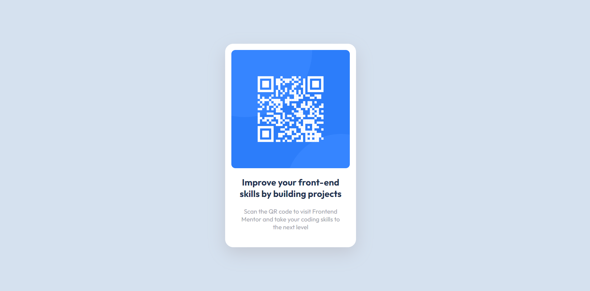

# Frontend Mentor - QR code component solution

This is a solution to the [QR code component challenge on Frontend Mentor](https://www.frontendmentor.io/challenges/qr-code-component-iux_sIO_H). Frontend Mentor challenges help you improve your coding skills by building realistic projects. 

## Table of contents

- [Overview](#overview)
  - [Screenshot](#screenshot)
  - [Links](#links)
- [My process](#my-process)
  - [Built with](#built-with)
  - [What I learned](#what-i-learned)
  - [Continued development](#continued-development)

## Overview

### Screenshot

### Links

- Solution URL: [Add solution URL here](https://github.com/alechekhova/QR-code-component)
- Live Site URL: [Add live site URL here](https://alechekhova.github.io/QR-code-component/)

## My process

### Built with

- Semantic HTML5 markup
- CSS
- Flexbox

### What I learned

This is my very first end-to-end web development project! 
It helped to go through the steps that I didn't experience while learning:
- Creating a project in VSCode
- Writing all the code from scratch
- Commiting the result to the GitHub

### Continued development

This is my very first project. So I feel it is still a bit chaotic, not very reusable or semantic. In the future I hope to focus on extending my knowledge in HTML and CSS to be able to write more organized and semantic code.

